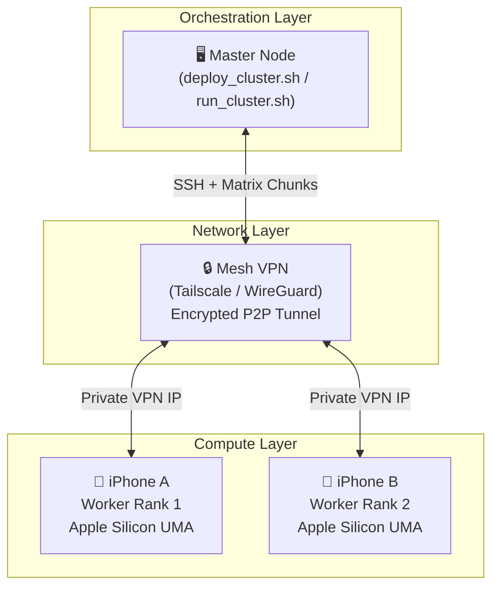
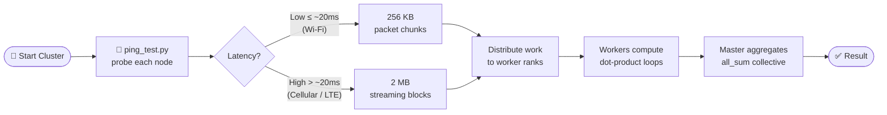
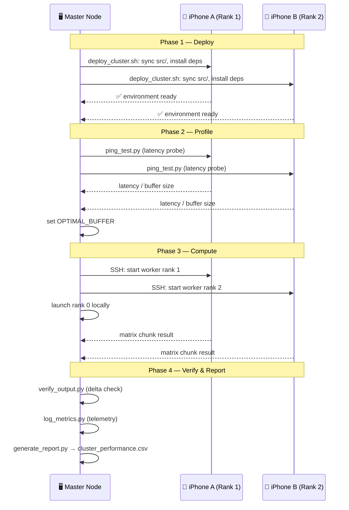

Part 1: Project Presentation Slides Outline
--

slide 1: Title & Overview
--
- Title: Over-the-Internet VRAM Pooling and Distributed Compute Cluster
- Subtitle: Leveraging Bash Process Orchestration and iOS Unified Memory Architectures
- Core Concept: A cost-effective, parallel matrix computing engine utilizing personal smartphones as distributed worker nodes across a secure VPN tunnel.

slide 2: The Problem & Constraints
--
- The Hardware Bottleneck: Massive AI model runs and heavy matrix multiplication fail on single consumer devices due to Out-Of-Memory (OOM) VRAM limits.
- The Unconventional Resource: iPhones use a Unified Memory Architecture (UMA) where the high-bandwidth Apple Silicon GPU and CPU share the same system memory.
- The Solution: Aggregating this fragmented hardware using a secure, internet-routed cluster pipeline.

slide 3: System Architecture
--
- Orchestration Layer: A lightweight, parallelized Bash scripting framework handling authentication, remote processes, and environment setups.
- Network Layer: Mesh VPN (Tailscale/WireGuard) creating an encrypted peer-to-peer network tunnel using static virtual IPs.
- Compute Engine: Multi-threaded distributed Python endpoints using raw socket servers to exchange split matrix configurations.

slide 4: Adaptive Optimization (The Key Innovation)
--
- The Network Bottleneck: Internet routing introduces erratic ping latencies that can paralyze traditional parallel cluster configurations.
- Dynamic Packet Tuning: An automated network ping test executes right before data distribution.
- Low Latency (Wi-Fi): Drops down to responsive 256KB packet chunks.
- High Latency (Cellular/LTE): Automatically scales to large 2MB streaming data blocks to maximize throughput.

slide 5: Technical Execution Workflow
--
- Deployment: deploy_cluster.sh uses parallel background tasks to sync code, detect operating systems (iSH Alpine vs Native iOS), and configure dependencies automatically.
- Profiling: run_cluster.sh benchmarks connection latencies and starts remote background worker ranks over SSH.
- Calculation: Workers stream data chunks, process heavy dot-product row loops inside their hardware memory pools, and return calculations.
- Verification: The master node aggregates chunks, renders progress bars, saves a final unified .csv report, and engages mathematical delta checkers.

slide 6: Key Findings & Performance Scaling
--
- Compute vs. Network Cost: iPhone hardware handles local matrix multiplication instantly, but internet bandwidth limits linear speedup scaling.
- Amdahl's Law in Action: The project illustrates how a slower communication layer introduces parallel overhead, demonstrating real-world high-performance computing (HPC) constraints.

Notes:
--
- There are approximately 1.52 billion active iPhone users worldwide.
- To match the raw compute and VRAM footprint of a single NVIDIA RTX 3090 (35.6 FP16 TFLOPS, 24GB VRAM), you would need a cluster of roughly 15 to 20 iPhone 15 Pro Max devices.
