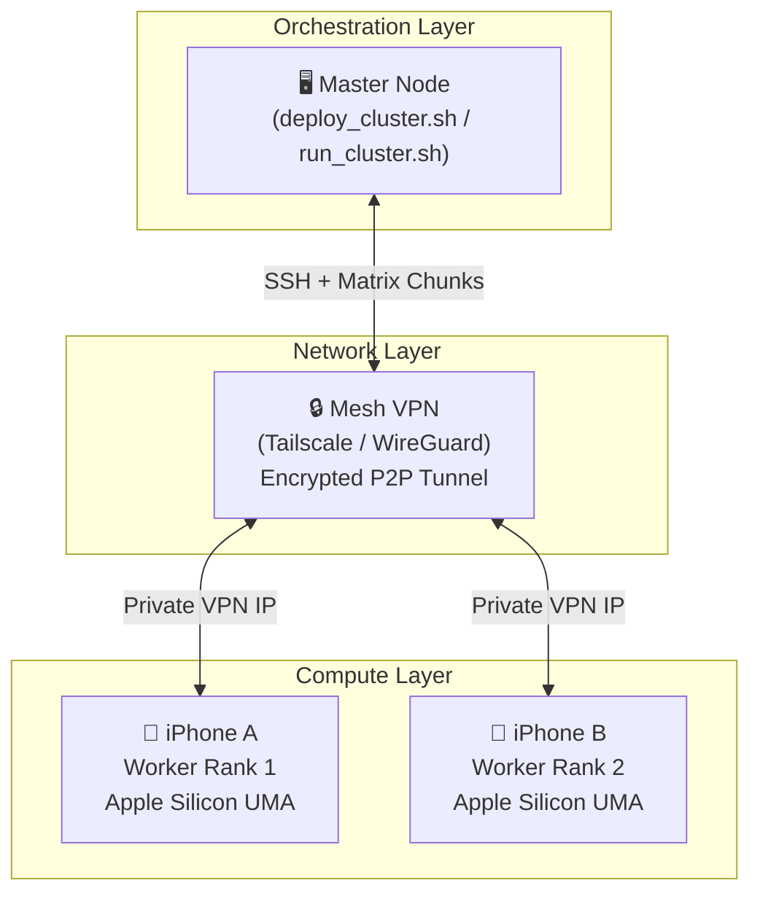
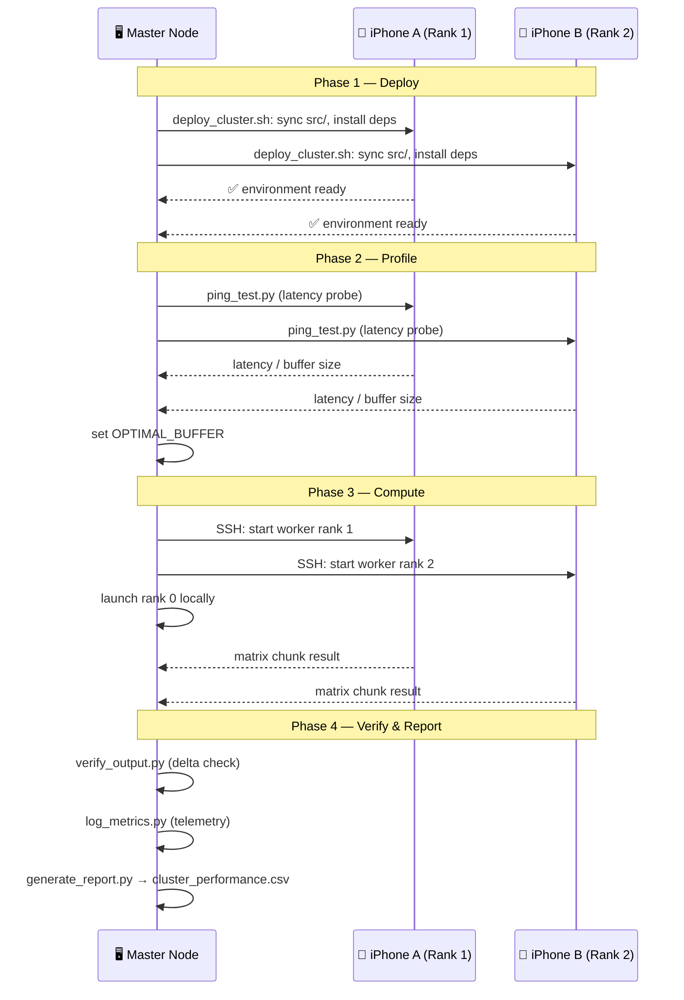

# Distributed Compute Cluster

An experimental over-the-Internet distributed compute cluster that coordinates multiple devices (iPhones, Macs, and other SSH-reachable nodes) via a VPN mesh. Workloads are split across nodes, processed in parallel, and results are synchronized using Python-based collective operations.

---

## Architecture



Adaptive Optimization (The Key Innovation)
--
- The Network Bottleneck: Internet routing introduces erratic ping latencies that can paralyze traditional parallel cluster configurations.
- Dynamic Packet Tuning: An automated network ping test executes right before data distribution.
- Low Latency (Wi-Fi): Drops down to responsive 256KB packet chunks.
- High Latency (Cellular/LTE): Automatically scales to large 2MB streaming data blocks to maximize throughput.


Technical Execution Workflow
--
- Deployment: deploy_cluster.sh uses parallel background tasks to sync code, detect operating systems (iSH Alpine vs Native iOS), and configure dependencies automatically.
- Profiling: run_cluster.sh benchmarks connection latencies and starts remote background worker ranks over SSH.
- Calculation: Workers stream data chunks, process heavy dot-product row loops inside their hardware memory pools, and return calculations.
- Verification: The master node aggregates chunks, renders progress bars, saves a final unified .csv report, and engages mathematical delta checkers.



Key Findings & Performance Scaling
--
- Compute vs. Network Cost: iPhone hardware handles local matrix multiplication instantly, but internet bandwidth limits linear speedup scaling.
- Amdahl's Law in Action: The project illustrates how a slower communication layer introduces parallel overhead, demonstrating real-world high-performance computing (HPC) constraints.
=======
```text
[ Master Node (PC/Mac) ]
       |
  VPN Tunnel (Tailscale / WireGuard)
       |
  +----+----+
  |         |
[Worker A] [Worker B]
(RANK 1)  (RANK 2)
```

- **Orchestration layer:** Bash scripts manage SSH connections, environment setup, and process lifecycle.
- **Network layer:** Mesh VPN (Tailscale or WireGuard) provides encrypted peer-to-peer connectivity with stable private IPs.
- **Compute layer:** Python worker processes exchange split workload chunks and synchronize via `all_sum` collectives.
- **Adaptive tuning:** Network latency is profiled before each run to set an optimal packet buffer size.

---

## Quick Start

### Prerequisites

- Tailscale or WireGuard installed and connected on all devices.
- SSH key-based auth configured (see [`docs/ssh_hardening.md`](docs/ssh_hardening.md)).
- Python 3 + `numpy` (and optionally `mlx`) on all nodes.
- macOS worker nodes should have either Python 3 preinstalled or Homebrew available so `deploy_cluster.sh` can install it automatically.

### 1. Deploy dependencies to worker nodes

```bash
bash deploy_cluster.sh
```

### 2. Run the cluster

```bash
bash run_cluster.sh
```

### 3. View the report

```bash
cat FINAL_PROJECT_SUMMARY.md
```

For detailed step-by-step commands including smoke tests and troubleshooting, see [`docs/run_commands.md`](docs/run_commands.md).

---

## File Structure

```
deploy_cluster.sh            # Node provisioning: connectivity, packages, file sync
run_cluster.sh               # Orchestration: latency profile, spawn workers, cleanup
verify_output.py             # Numerical correctness checks
log_metrics.py               # Telemetry logging and CSV output
generate_report.py           # Final Markdown report generation
src/train_dist.py            # Distributed compute entrypoint (runs on each rank)
src/ping_test.py             # Network latency probe (returns buffer recommendation)
docs/ssh_hardening.md        # SSH security hardening guide
docs/latency_benchmark_samples.md  # Example benchmark outputs and interpretation
docs/run_commands.md         # Reproducible copy-paste run commands
docs/Technical_Guide.md      # Extended architecture notes and context
```

---

## Known Constraints

| Constraint | Description |
|------------|-------------|
| **Network bottleneck** | Internet latency is much higher than local interconnects; collective ops become communication-bound quickly. |
| **iOS background limits** | iOS may suspend background terminal sessions; keep the screen active during runs. |
| **WAN jitter** | Packet loss and jitter cause straggler ranks; the orchestrator retries SSH connections and aborts on persistent failure. |
| **Amdahl's Law** | Communication overhead grows with node count; speedup tapers off beyond a small cluster size. |

---

## Documentation

| Document | Contents |
|----------|----------|
| [`docs/ssh_hardening.md`](docs/ssh_hardening.md) | Key-based auth, disable password auth, VPN firewall rules, fail2ban, audit logging |
| [`docs/latency_benchmark_samples.md`](docs/latency_benchmark_samples.md) | Sample ping/CSV output and scaling decision table |
| [`docs/run_commands.md`](docs/run_commands.md) | Step-by-step reproducible commands for the full workflow |
| [`docs/Technical_Guide.md`](docs/Technical_Guide.md) | Extended architecture notes, slide outline, and source quality notes |

By default, Linux/iPhone-style workers deploy into `/app`, while macOS workers deploy into `~/dist_cluster`. Set `REMOTE_PROJECT_DIR` before running the scripts to override that path for every worker.

mgreen@mykol.com
