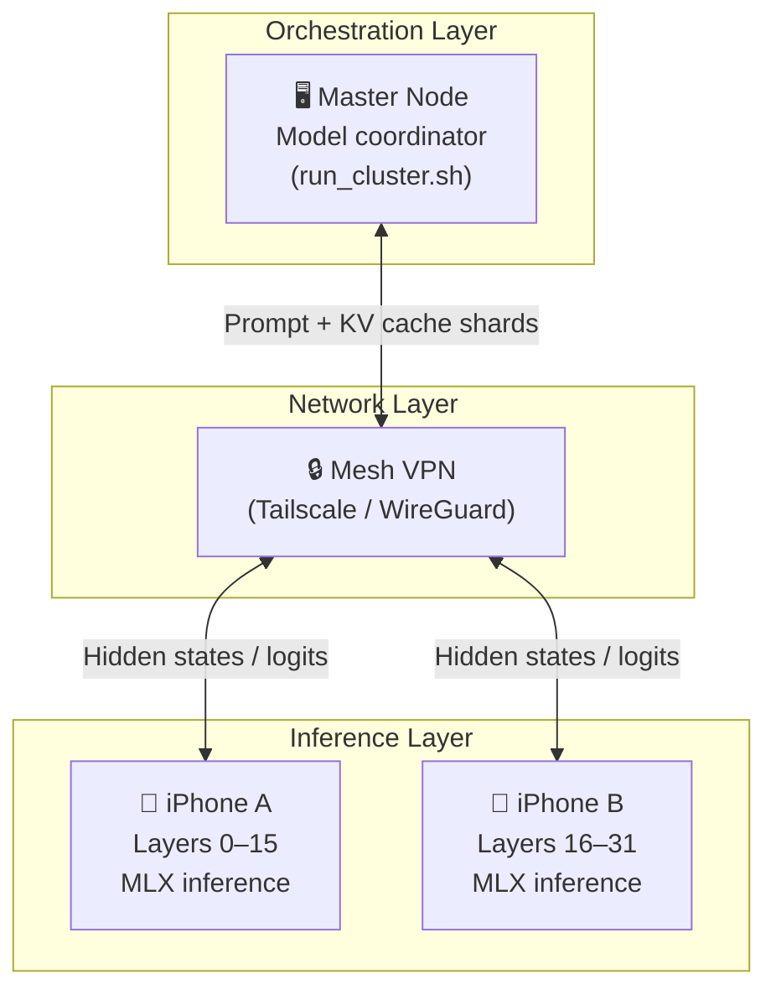
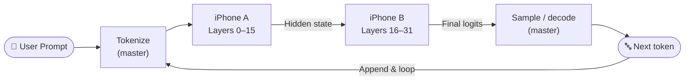
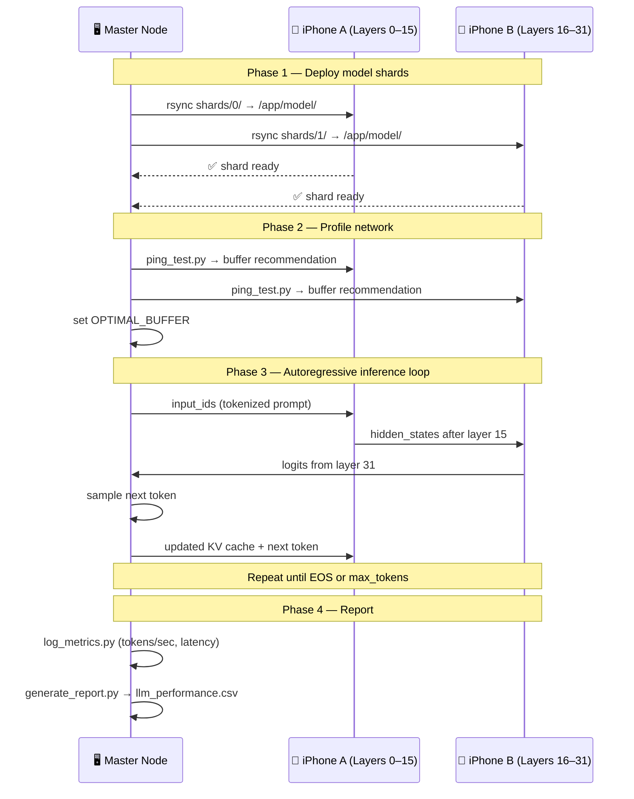

# AI LLM Use Case — Distributed Cluster Inference

This document describes how the distributed compute cluster can be extended to run
large language model (LLM) inference across multiple Apple Silicon devices using
**MLX** and the existing VPN mesh infrastructure.

---

## Overview

Modern LLMs are too large to fit in the memory of a single consumer device.  A
distributed approach splits the model layers across several nodes, pipelines token
generation, and aggregates results back on the master node — all over the encrypted
VPN mesh that already powers this cluster.

> **Key insight:** Apple Silicon iPhones and Macs share CPU/GPU memory in a unified
> memory architecture (UMA).  MLX is purpose-built to exploit this, making
> device-local token generation fast.  The cluster turns that per-device speed into
> collective inference capacity.

---

## Architecture



---

## Pipeline Strategy

LLM inference is split using **pipeline parallelism**: each worker node owns a
consecutive slice of the model's transformer layers.  The activation tensor from the
last layer of one shard is forwarded to the next node over the VPN.



---

## Adaptive Packet Sizing for LLM Payloads

Hidden-state tensors are large (sequence × hidden-dim × dtype bytes).  The existing
`ping_test.py` latency probe drives the same adaptive buffer logic used for matrix
workloads:

| Condition | Buffer size | Rationale |
|-----------|-------------|-----------|
| Low latency ≤ 20 ms (Wi-Fi) | 256 KB chunks | Minimize per-token round-trip |
| High latency > 20 ms (LTE) | 2 MB blocks | Amortize transfer overhead |

---

## Setup

### Prerequisites

- All nodes connected via Tailscale or WireGuard (see [`ssh_hardening.md`](ssh_hardening.md)).
- MLX installed on every node: `pip install mlx mlx-lm`.
- A compatible model downloaded and sharded across node storage (e.g., Llama-3 8B).

### 1. Shard the model weights

```bash
# On master — split a Hugging Face checkpoint into per-node layer slices
python3 src/shard_model.py \
  --model-path ./models/llama3-8b \
  --num-shards 2 \
  --output-dir ./shards
```

### 2. Sync shards to worker nodes

```bash
bash deploy_cluster.sh   # existing deploy script handles rsync to each node
```

### 3. Start the inference cluster

```bash
bash run_cluster.sh --mode llm --prompt "Explain pipeline parallelism."
```

---

## Execution Workflow



---

## Performance Considerations

| Factor | Impact |
|--------|--------|
| **Model size** | Larger models benefit more from distribution; small models may be faster on a single device. |
| **Sequence length** | Longer contexts increase hidden-state transfer size each step. |
| **Network latency** | Each forward pass incurs one full round-trip between shards; Wi-Fi strongly preferred. |
| **Apple Silicon UMA** | No CPU↔GPU copy overhead; each node's GPU and CPU share the same memory pool. |
| **Amdahl's Law** | Communication overhead grows with shard count; 2–3 nodes is typically optimal for consumer hardware. |

---

## Known Constraints

| Constraint | Description |
|------------|-------------|
| **iOS background limits** | iOS may suspend long-running inference jobs; keep the display active. |
| **WAN jitter** | Token latency spikes when the hidden-state transfer stalls; the orchestrator retries on timeout. |
| **KV cache size** | Each node caches only its own layers; the master coordinates cache consistency. |
| **Model compatibility** | Only models with clean layer-wise APIs (HuggingFace / MLX) are straightforward to shard. |

---

## Related Documents

| Document | Contents |
|----------|----------|
| [`ssh_hardening.md`](ssh_hardening.md) | Securing SSH access across VPN nodes |
| [`latency_benchmark_samples.md`](latency_benchmark_samples.md) | Ping/CSV output and buffer-size decisions |
| [`run_commands.md`](run_commands.md) | Reproducible commands for the full workflow |
| [`Technical_Guide.md`](Technical_Guide.md) | Extended architecture notes |

mgreen@mykol.com
