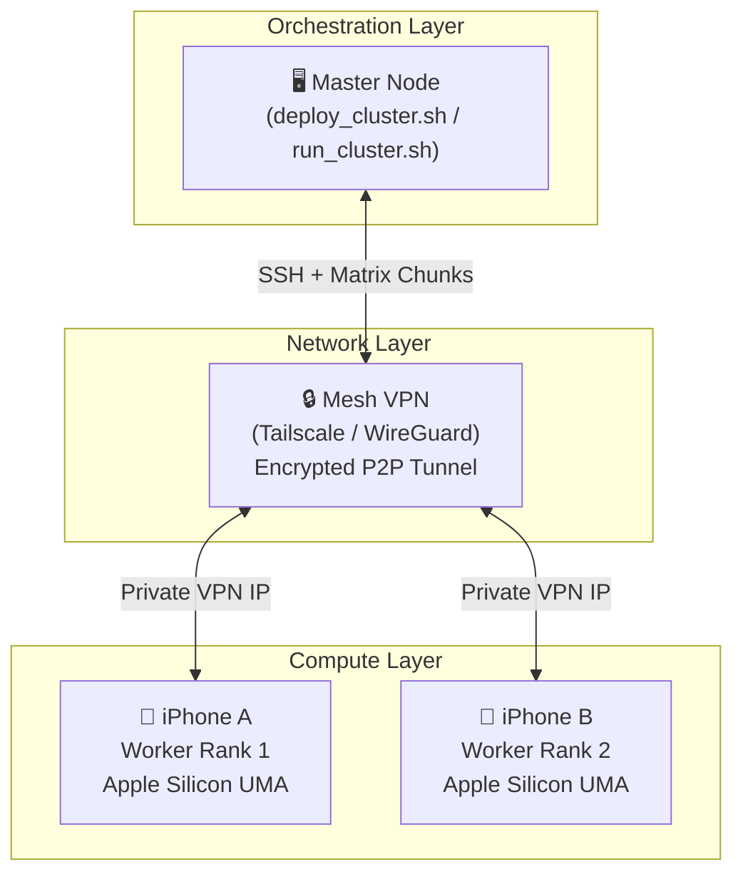
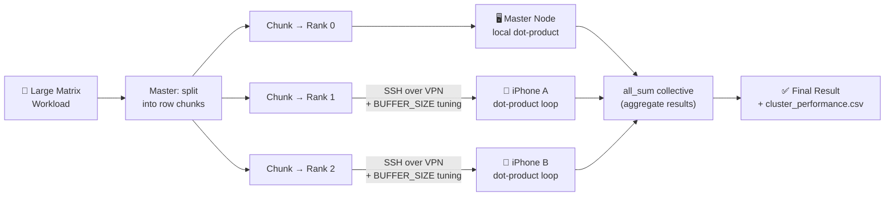
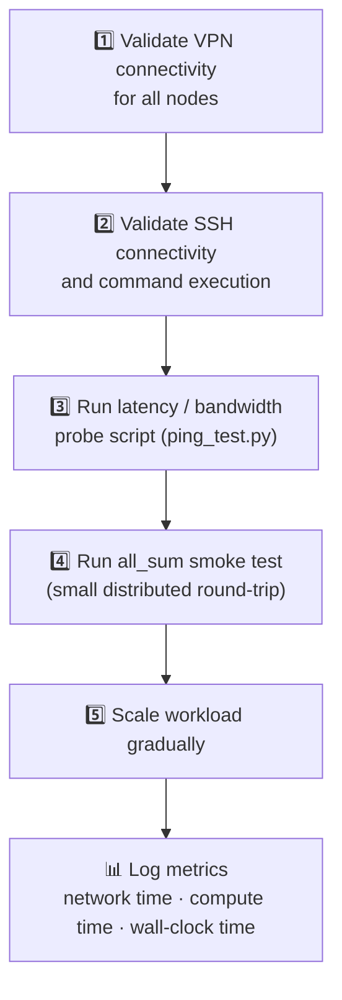

# Technical Guide - Distributed Cluster

This guide expands on the project overview from `index.html` and presents the same architecture, workflow, and diagram style in a documentation-focused format.

---

## Overview

This distributed compute experiment coordinates multiple devices over a secure network.
Instead of transferring raw VRAM contents across devices, the practical approach is to split model or workload state across nodes and synchronize intermediate results.

---

## High-Level Architecture



---

## Step 1 - Establish a Secure Network Tunnel

All nodes must be reachable on a common private network.

- Install a secure mesh VPN such as Tailscale or WireGuard on the orchestrator and each worker device.
- Verify each node has a stable private VPN IP.
- Validate connectivity with `ping` and `ssh` before starting distributed jobs.

---

## Step 2 - Bash Orchestrator (Master Control)

The host script starts worker processes remotely over SSH and launches rank 0 locally.

```bash
#!/usr/bin/env bash
set -euo pipefail

# VPN IP addresses (examples only)
MASTER_IP="100.11.22.33"
IPHONE_A_IP="100.11.22.44"
IPHONE_B_IP="100.11.22.55"

WORLD_SIZE=3   # total processes: rank 0 + two workers
PORT=8080

echo "Initializing distributed cluster..."

# 1) Start worker rank 1
ssh mobile@"$IPHONE_A_IP" \
  "cd /app && mx.distributed --world-size $WORLD_SIZE --rank 1 --master-addr $MASTER_IP --master-port $PORT python3 train_dist.py" &  # run in background

# 2) Start worker rank 2
ssh mobile@"$IPHONE_B_IP" \
  "cd /app && mx.distributed --world-size $WORLD_SIZE --rank 2 --master-addr $MASTER_IP --master-port $PORT python3 train_dist.py" &  # run in background

# 3) Start rank 0 on master
echo "Launching master process..."
mx.distributed --world-size "$WORLD_SIZE" --rank 0 --master-addr "$MASTER_IP" --master-port "$PORT" python3 train_dist.py

wait
echo "Distributed processing finished."
```

### SSH Notes

- Use key-based authentication only.
- Restrict SSH exposure to the VPN interface.
- Prefer non-root users with minimal privileges.

---

## Step 3 - Worker Script (`train_dist.py`)

Each process initializes distributed communication and runs synchronized operations.

```python
import mlx.core as mx

mx.distributed.init()

rank = mx.distributed.get_rank()
world_size = mx.distributed.get_world_size()

if rank == 0:
    print(f"Master node online. World size: {world_size}")

x = mx.array([1.0, 2.0, 3.0]) * (rank + 1)
sum_x = mx.distributed.all_sum(x)

print(f"Rank {rank} synchronized data: {sum_x}")
```

### Matrix Data-Flow Diagram



---

## Known Constraints and Risks

### 1) Network Bottleneck

- Device-local memory bandwidth is much higher than Internet links.
- Collective operations such as `all_sum` can become communication-bound quickly.

### 2) iOS Background Execution Limits

- iOS may suspend or terminate long-running background terminal processes.
- Keep apps active and device power settings in mind during experiments.

### 3) Reliability

- WAN jitter and packet loss can create stragglers and unstable step times.
- Add retries, health checks, and timeout handling in orchestration scripts.

---

## Suggested Validation Workflow



---

## Presentation Outline

### Slide 1 - Title

**Over-the-Internet Distributed Compute Cluster**
Using Bash orchestration, a secure VPN mesh, and Python distributed workers.

### Slide 2 - Problem

Single-device memory and compute limits for larger matrix or model workloads.

### Slide 3 - Architecture

Master orchestrator, VPN mesh, remote worker ranks, and synchronized collectives.

### Slide 4 - Optimization Idea

Adaptive chunk sizing and communication strategy based on measured latency.

### Slide 5 - Execution Flow

Deploy → profile network → launch ranks → compute → verify → report.

### Slide 6 - Results and Trade-offs

Speedup versus communication overhead, with an Amdahl's Law interpretation.

---

## Automated Summary Report Generator (`generate_report.py`)

Use a reporting script to compile telemetry into a final Markdown report.

### Purpose

- Parse `cluster_performance.csv`.
- Compute speedup metrics.
- Emit `FINAL_PROJECT_SUMMARY.md`.

### Recommended Quality Improvements

- Add argument parsing with `argparse` for log and report paths.
- Validate CSV schema before reading.
- Handle malformed numeric fields with guarded parsing.
- Include min, avg, and max latency plus per-run variance.
- Add exit codes for CI usage.

---

## Pipeline Hook Example (`run_cluster.sh`)

Append post-run hooks:

```bash
# 4) Invoke logger and report generator
if [ -f "./log_metrics.py" ]; then
  python3 ./log_metrics.py "$WORLD_SIZE" "$MOCK_NET_TIME" "$MOCK_COMP_TIME" "$TOTAL_TIME"
fi

if [ -f "./generate_report.py" ]; then
  python3 ./generate_report.py
fi
```

---

## Expected Project Structure

```text
deploy_cluster.sh        # node provisioning and setup
run_cluster.sh           # orchestration and benchmark execution
verify_output.py         # numerical correctness checks
log_metrics.py           # telemetry logging and graph outputs
generate_report.py       # final markdown report generation
src/train_dist.py        # distributed compute entrypoint
src/ping_test.py         # network latency evaluation
```

---

## Source Quality Note

The original notes include mixed references such as forums, social posts, slide sites, and generated narrative.
For final academic or professional submission, prefer:

- official framework documentation
- reproducible benchmarks
- primary technical references
- clearly versioned tooling and environment details

---

## Next Actions

- [x] Add SSH hardening guide (`docs/ssh_hardening.md`)
- [x] Add latency benchmark script output samples (`docs/latency_benchmark_samples.md`)
- [x] Add reproducible run command examples (`docs/run_commands.md`)
- [x] Add failure-handling and retry strategy in orchestration (`run_cluster.sh`)
- [x] Add a concise README version of this architecture (`README.md`)

[mgreen@mykol.com](mailto:mgreen@mykol.com)
